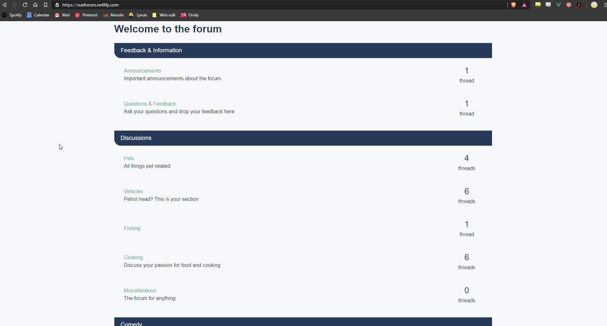
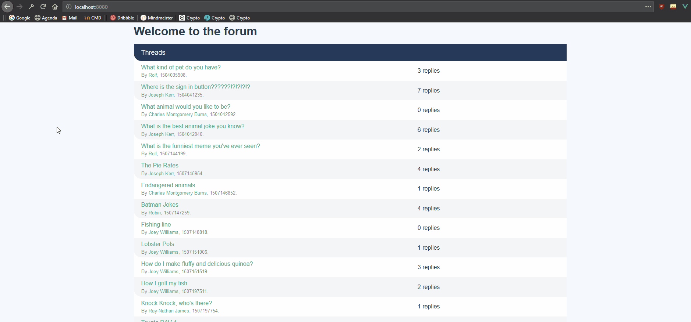
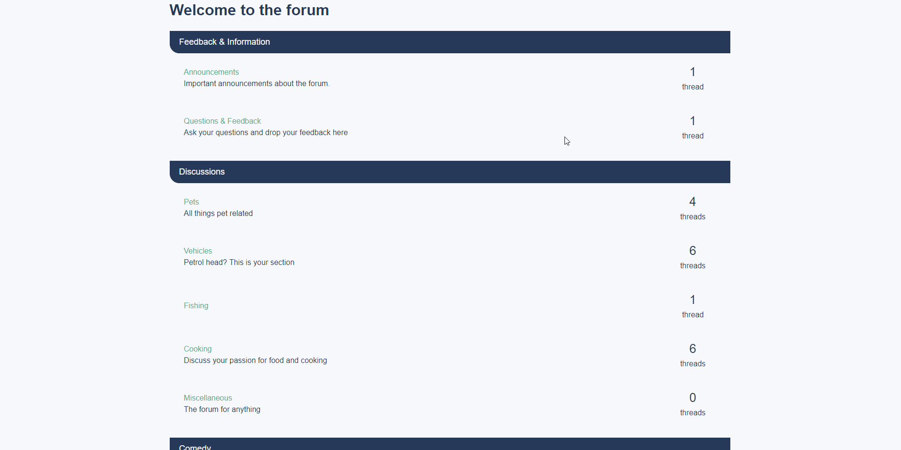
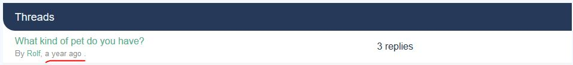
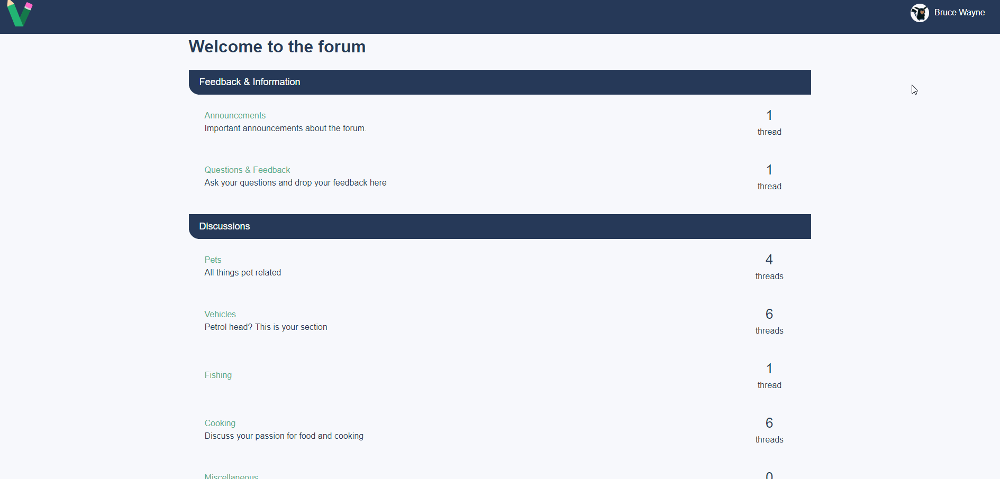

# VueForum


This project serve as a learning purpose to get a better understanding of Vue.js. The course is coming from [Vue School Master Class](https://vueschool.io/courses/the-vuejs-master-class) were we will create a Forum Application from scratch. 

The course covers the fundamentals, like:
- Vue cli, router and State management with Vuex
- Modern Javascript (ES6/7/8)
- User permissions & protected routes
- Third party authentication
- Firebase Realtime Database & Cloud functions
- Automatic code review with ESLint
- Deployment
- Application architecture, best practices and many more. 

## Project setup
```
npm install
```

### Compiles and hot-reloads for development
```
npm run serve
```

### Compiles and minifies for production
```
npm run build
```

### Open at standard port:8080
```
localhost:8080
```

## Components structure

**Main**
```
_App
  |_PageHome
    |_CategoryListItem
```

**Category**
```
_PageCategory
  |_ForumList
    |_FormListItem
```

**Forum**
```
_PageForum
  |_ThreadList
    |_ThreadListItem
      |_AppDate
```

**Threads**
```
PageThreadShow
  |_AppDate
  |_PostEditor
  |_PostListItem
    |_AppDate
```

## Process
*In this section you'll find all the work that I've done on a weekly basis.*

### Week 1
- [x] Scaffold project with Vue CLI3
- [x] Structuring data
- [x] Import data source and render this in components 
- [x] Add styling through the Css Scoped and Css Module functionality
- [x] Add and learn about Vue Router
- [x] Learn about Props and Computed properties and add this to the project
- [x] Add Router Link to make this a Single Page Application
- [x] Reorganize components to make it more scale-able
- [x] Learn how to handle not found pages

#### Result



#### Notes

##### Css scoped and Css module
###### Css scoped
When a `<style>` tag has the scoped attribute, its CSS will apply to elements of the current component only. This is similar to the style encapsulation found in Shadow DOM. It comes with some caveats, but doesn't require any polyfills. It is achieved by using PostCSS to transform the following:

```html
<style scoped>
.example {
  color: red;
}
</style>

<template>
  <div class="example">hi</div>
</template>
```

to the following

```html
<style>
.example[data-v-f3f3eg9] {
  color: red;
}
</style>

<template>
  <div class="example" data-v-f3f3eg9>hi</div>
</template>
```


###### CSS Module
CSS Modules is a popular system for modularizing and composing CSS. vue-loader provides first-class integration with CSS Modules as an alternative for simulated scoped CSS.

**Usage:**  add the module attribute to your `<style>`:
```html
<style module>
.red {
  color: red;
}
.bold {
  font-weight: bold;
}
</style>
``` 

The module attribute instructs Vue Loader to inject the CSS modules locals object into the component as a computed property with the name $style. You can then use it in your templates with a dynamic class binding:

```html
<template>
  <p :class="$style.red">
    This should be red
  </p>
</template>
```

##### Vue Router
Vue Router is the official router for Vue.js. It deeply integrates with Vue.js core to make building Single Page Applications with Vue.js a breeze.

##### Router link
`<router-link>` is the component for enabling user navigation in a router-enabled app. The target location is specified with the to prop. It renders as an `<a>` tag with correct href by default, but can be configured with the tag prop. In addition, the link automatically gets an active CSS class when the target route is active. 

```html
<!-- literal string -->
<router-link to="home">Home</router-link>

<!-- renders to -->
<a href="home">Home</a>
```

##### Router view
The `<router-view>` component is a functional component that renders the matched component for the given path.

**Usage:** To use it, just add `router-view` element.
```html
<router-view/>
```

##### History mode
The default mode for vue-router is hash mode - it uses the URL hash to simulate a full URL so that the page won't be reloaded when the URL changes.

To get rid of the hash, we can use the router's history mode, which leverages the history.pushState API to achieve URL navigation without a page reload.

When using history mode, the URL will look "normal," e.g. http://oursite.com/user/id. Beautiful!

```javascript
const router = new VueRouter({
  mode: 'history',
  routes: [...]
})
```

##### Props and computed properties

###### Props
Component won’t be useful unless you can pass data to it, that’s where props come in.

Props are custom attributes you can register on a component. When a value is passed to a prop attribute, it becomes a property on that component instance.

**Usage:**
You can use props like this 
*(this is in an child component)*
```javascript
props: {
            post: {
                required: true,
                type: Object
            }
        }
```

In the parent components you can pass the the data to the props like this:

```html
    <PostListItem :post="post"/>
```

##### Computed properties
In-template expressions are very convenient, but they are meant for simple operations. Putting too much logic in your templates can make them bloated and hard to maintain. For example:

```html
<div id="example">
  {{ message.split('').reverse().join('') }}
</div>
```

At this point, the template is no longer simple and declarative. You have to look at it for a second before realizing that it displays message in reverse. The problem is made worse when you want to include the reversed message in your template more than once.

That’s why for any complex logic, you should use a **computed property**.

Computed property make the code more readable, for example:

```javascript
  data: {
    message: 'Hello'
  },
  computed: {
    reversedMessage: function () {
      return this.message.split('').reverse().join('')
    }
  }
```

```html
<div id="example">
  <p>Computed reversed message: "{{ reversedMessage }}"</p>
</div>
```


### Week 2
- [x] Tidy up messy components
- [x] Learn about two way binding and at this to the project
- [x] Add discussion component
- [x] Learn how to communicate between components through the vm.$emit API
- [x] Learn about object Destructuring and at this to the project
- [x] Transform date to be human friendly
- [x] Learn about Base and Global Components
- [x] Add Categories component


#### Result


#### Date result
date before


date after





#### Notes

##### Object Destructuring
*ES6 In Depth: Destructuring - By Nick Fitzgerald, Jason Orendorff - from: https://hacks.mozilla.org/2015/05/es6-in-depth-destructuring/*

Destructuring assignment allows you to assign the properties of an array or object to variables using syntax that looks similar to array or object literals. 

Destructuring on objects lets you bind variables to different properties of an object. You specify the property being bound, followed by the variable you are binding its value to.

```javascript
var { foo, bar } = { foo: "lorem", bar: "ipsum" };
console.log(foo);
// "lorem"
console.log(bar);
// "ipsum"
```

##### Object.values()

`Object.values()` returns an array whose elements are the enumerable property values found on the object. The ordering of the properties is the same as that given by looping over the property values of the object manually.

```javascript
const object1 = {
  a: 'somestring',
  b: 42,
  c: false
};

const test = Object.values(object1)

console.log(test);
// expected output: Array ["somestring", 42, false]
```


##### Vue emit

The child component sometimes wants to communicate to the parent component, you can achieve this by using the vue.$emit api.

**Usage:**

When clicking on the button the child child will *emit* a *welcome* event to every parent components.
```html
 <button v-on:click="$emit('welcome')">
      Click me to be welcomed
</button>
```

The parent component can than listen to this event and create a logic from this event.

*The welcome event will trigger the `sayHi` function*
```html
<div>
  <welcome-button @welcome="sayHi"></welcome-button>
</div>
```

```javascript
methods: {
    sayHi: function () {
      alert('Hi!')
    }
  }
```

##### Two-way binding
*source: Exploring Vue.js: Reactive Two-Way Data Binding-Anthony Gore-https://medium.com/js-dojo/exploring-vue-js-reactive-two-way-data-binding-da533d0c4554 *

One of the core features of Vue.js is it’s reactive data binding system. In simple terms: it keeps your data (i.e. your Javascript variables, arrays etc) in sync with your DOM without you having to do anything.

```html
<div id="app">
  <span>{{message}}</span>
</div>

<script type="text/javascript">
  var message = 'Vue.js is rad';
  new Vue({ el: '#app', data: { message } });
</script>

// Changing the value of message in the JS to something else 
// will be reflected automatically in the DOM. Nice.
```

Okay, so that’s one-way data binding i.e. binding a JS variable to the DOM. Two-way binding is when data is also bound from the DOM back to JS.

For example, what if we could change the value of message in the DOM via an input? No problemo. Just add an input to the document with an attribute v-model and assign it our message property i.e.:

```html
<div id="app">
  <span>{{message}}</span><br/>
  <input v-model="message">
</div>

<script type="text/javascript">
  var message = 'Vue.js is rad';
  new Vue({ el: '#app', data: { message } });
</script>
```

That’s it. Nothing else. Now, if we type anything into our input, our JS variable is updated with the change, which in turn updates our span. Super nice.

#### Component registration
Components are reusable Vue instances with a name and can be reused as many times as you want.

##### Global registration

When you're using a component a lot of times it is handy to register this globally so that you can use this component in all vue instances.

```javascript
Vue.component('component-a', { /* ... */ })
Vue.component('component-b', { /* ... */ })
Vue.component('component-c', { /* ... */ })

new Vue({ el: '#app' })
```

```html
<div id="app">
  <component-a></component-a>
  <component-b></component-b>
  <component-c></component-c>
</div>
```


##### Local registration
Global registration often isn’t ideal. For example: globally registering all components means that even if you stop using a component, it could still be included in your final build. This unnecessarily increases the amount of JavaScript your users have to download.

In these cases, you can define your components as plain JavaScript objects:

```javascript
var ComponentA = { /* ... */ }
var ComponentB = { /* ... */ }
var ComponentC = { /* ... */ }
```

```javascript
new Vue({
  el: '#app',
  components: {
    'component-a': ComponentA,
    'component-b': ComponentB
  }
})
```


### Week 3
- [x] Migrate old State to Vuex
- [x] Creating post using Vuex
- [x] Add navigation bar
- [x] Grab authenticated user
- [x] Add user profile page
- [x] Add utility functionality
- [x] Add profile editor component
- [x] Add functionality to update the profile
- [x] Learn about share page component
- [x] Fix bug where post and authenticated user doesn't match

#### Result



#### Vuex

##### Actions

##### Mutation

##### State

##### Getters

##### MapGetters
